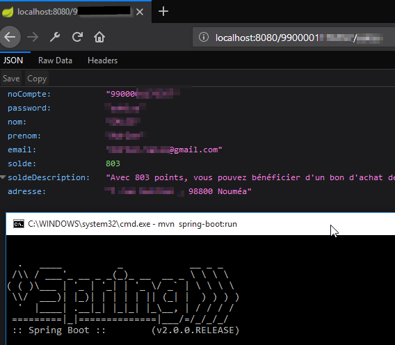

[](https://travis-ci.org/adriens/carte-conso-plus-api)
[](https://beta.gemnasium.com/projects/github.com/adriens/carte-conso-plus-api)
[](https://app.getpostman.com/run-collection/deffc8e0359909a35d44)

# carte-conso-plus-api

API pour interagir avec le site (http://www.consoplus.nc/) de la Carte Conso + (Nouvelle-Calédonie).

# Demo



# Endpoints

`/` : welcome message

`/{login}/{password}` : main details

`/{login}/{password}/solde` : le solde brut (pas de json)

`/{login}/{password}/detail` : le detail décrit, brut (pas de json)

# Heroku

```
https://carte-conso-plus.herokuapp.com/
https://carte-conso-plus.herokuapp.com/{YOUR_LOGIN}/{YOUR_PASSWORD}
https://carte-conso-plus.herokuapp.com/{YOUR_LOGIN}/{YOUR_PASSWORD}/detail
https://carte-conso-plus.herokuapp.com/{YOUR_LOGIN}/{YOUR_PASSWORD}/solde
```
# Postman doc

[Postman documentation](https://documenter.getpostman.com/view/3489712/carte-conso-plus/RVnZgHts)
